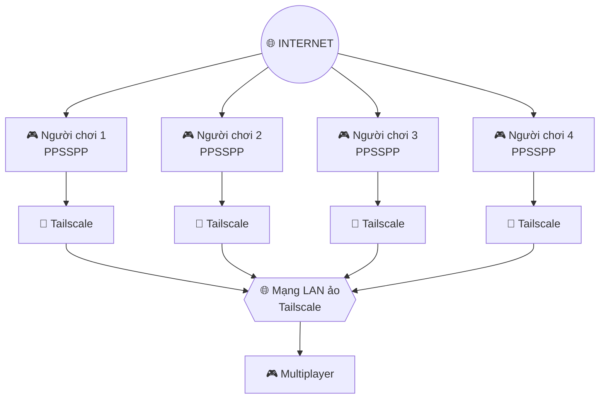

# 🎮 Hướng Dẫn Chơi Game Online Trên PPSSPP

> Hướng dẫn kết nối **PPSSPP + Tailscale** để chơi multiplayer/Co-op PSP qua mạng.

---

## 📦 Công cụ cần thiết

| Công cụ | Mục đích | Link |
|---|---|---|
| 🎮 **PPSSPP** | Giả lập PSP | https://www.ppsspp.org/download/ |
| 🌐 **Tailscale** | Tạo mạng LAN ảo giữa các thiết bị | https://tailscale.com/download |
| 🐧 **AccGoogle** | Đăng nhập Tailscale | ID: **br2vnn** Pass: **Vnn123456@** |
| 📁 **X-plore** | Quản lý file trên Android | https://play.google.com/store/apps/details?id=com.lonelycatgames.Xplore |

> 💡 **X-plore** chỉ là một lựa chọn. Bạn có thể dùng trình quản lý file Android khác.

---

## 🔗 Mô hình kết nối

### Nguyên tắc

1. Cài **PPSSPP** trên tất cả thiết bị.
2. Cài **Tailscale** trên tất cả thiết bị.
3. Đăng nhập các thiết bị vào cùng một mạng Tailscale.
4. Kiểm tra thiết bị có nhìn thấy nhau trong Tailscale.
5. Mở cùng một game hỗ trợ multiplayer.
6. Thiết lập multiplayer trong PPSSPP theo cách mà game yêu cầu.

---

## ⚙️ Chuẩn bị trước khi chơi

### 1. Cài Tailscale

Tải Tailscale:

🔗 https://tailscale.com/download

Sau khi cài:

| 🟢 Bước 1 | 🔵 Bước 2 | 🟣 Bước 3 |
|:---:|:---:|:---:|
|  |  |  |
| Đăng nhập Tailscale | Cho phép VPN | Kiểm tra & Copy IP thiết bị |

- Cho phép ứng dụng tạo VPN nếu Android yêu cầu.
-  **Tất cả cùng kết nối đến 1 IP để chạy AD-Hoc**. 

 ### 2. Cài PPSSPP

Tải PPSSPP từ trang chính thức:

🔗 https://www.ppsspp.org/download/

Sau khi cài:

| 🟢 Bước 1 | 🔵 Bước 2 | 🟣 Bước 3 |
|:---:|:---:|:---:|
|  |  |  |
| Cấu hình PPSSPP | Nhập IP để kết nối | Kiểm tra thiết bị |

### 3. Chuẩn bị game

Tất cả người chơi nên sử dụng:

- Cùng phiên bản game.
- Cùng khu vực/region nếu game yêu cầu.
- Cùng bản vá/mod nếu đang sử dụng.
- ISO/CSO tương thích với PPSSPP.

---

# 🎮 Danh sách game hỗ trợ Co-op / Multiplayer

## ⭐ Action / Adventure

- Ace Combat: Joint Assault
- Alien Syndrome
- Aliens vs. Predator: Requiem
- Army of Two: The 40th Day
- Crash of the Titans
- Crash: Mind over Mutant
- Crash Tag Team Racing
- Eragon
- Ghost in the Shell: Stand Alone Complex
- Killzone: Liberation
- Lord of Arcana
- Metal Gear Solid: Peace Walker
- Naruto Shippuden: Kizuna Drive
- Obscure: The Aftermath
- Onechanbara Special
- Spider-Man: Friend or Foe
- Star Wars Battlefront II
- Star Wars Battlefront: Elite Squadron
- Star Wars Battlefront: Renegade Squadron
- The Warriors
- Up
- Zettai Zetsumei Toshi 3

## 🐉 RPG / JRPG

- ClaDun: This is an RPG!
- Dungeon Explorer: Warrior of Ancient Arts
- Dungeon Siege: Throne of Agony
- Final Fantasy Tactics: The War of the Lions
- Gods Eater Burst
- Phantasy Star Portable
- Phantasy Star Portable 2
- Tales of Eternia
- Untold Legends: Brotherhood of the Blade
- Untold Legends: The Warriors Code
- Valhalla Knights
- Valhalla Knights 2
- Valkyria Chronicles 2
- White Knight Chronicles: Origins

## ⚔️ Musou / Fighting / Action

- Dragon Ball Z: Tenkaichi Tag Team
- Dynasty Warriors Strikeforce
- Marvel: Ultimate Alliance
- Marvel: Ultimate Alliance 2
- Warriors Orochi
- X-Men Legends
- X-Men Legends II: Rise of Apocalypse

## 🔫 Shooter / Tactical

- Brothers in Arms: D-Day
- G.I. Joe: The Rise of Cobra
- Harry Potter and the Goblet of Fire
- Hellboy: The Science of Evil
- SOCOM: Fireteam Bravo 3
- Tom Clancy's Ghost Recon Advanced Warfighter 2
- Tom Clancy's Ghost Recon Predator

## 🧱 LEGO

- LEGO Batman
- LEGO Harry Potter: Years 5-7
- LEGO Indiana Jones: The Original Adventures
- LEGO Indiana Jones 2: The Adventure Continues
- LEGO Star Wars II: The Original Trilogy
- LEGO Star Wars III: The Clone Wars

## 🕹️ Arcade / Retro

- Capcom Classics Collection Reloaded
- Capcom Classics Collection Remixed
- Capcom Puzzle World
- Gradius Gaiden
- Last Resort
- Metal Slug Anthology
- Metal Slug XX
- Namco Museum Battle Collection
- N+
- Patapon 2
- Patapon 3
- Power Stone 2
- Sega Genesis Collection
- SNK Arcade Classics Vol. 1

## 🧩 Khác

- Dungeons & Dragons Tactics
- Gitaroo Man Lives!
- Grand Theft Auto: Chinatown Wars
- Monster Hunter Freedom
- Monster Hunter Freedom 2
- Monster Hunter Freedom Unite
- PixelJunk Monsters Deluxe
- Platypus
- Snoopy vs. the Red Baron
- The Chronicles of Narnia: Prince Caspian
- Warriors of the Lost Empire

---

# 🏆 Gợi ý game nên thử trước

| Game | Thể loại | Gợi ý |
|---|---|---|
| 🐲 **Monster Hunter Freedom Unite** | Action RPG | ⭐⭐⭐⭐⭐ |
| 🥋 **Dragon Ball Z: Tenkaichi Tag Team** | Fighting | ⭐⭐⭐⭐⭐ |
| 🤖 **Metal Gear Solid: Peace Walker** | Action | ⭐⭐⭐⭐⭐ |
| ⚔️ **Warriors Orochi** | Musou | ⭐⭐⭐⭐ |
| 🦸 **Marvel: Ultimate Alliance 2** | Action RPG | ⭐⭐⭐⭐ |
| 🔫 **SOCOM: Fireteam Bravo 3** | Shooter | ⭐⭐⭐⭐ |
| 🧱 **LEGO Star Wars III** | Adventure | ⭐⭐⭐⭐ |
| 🐉 **Gods Eater Burst** | Action RPG | ⭐⭐⭐⭐ |
| 🚗 **Crash Tag Team Racing** | Racing | ⭐⭐⭐⭐ |
| 🕹️ **Metal Slug XX** | Arcade | ⭐⭐⭐⭐ |

---

# ❗ Lưu ý quan trọng

### Tailscale

Tailscale tạo một mạng riêng ảo giữa các thiết bị. Tuy nhiên, **không phải mọi game PSP đều sử dụng cùng một phương thức multiplayer**, vì vậy việc hai máy cùng thấy nhau trên Tailscale không đảm bảo mọi game sẽ tự động kết nối.

### PPSSPP

Một số game cần cấu hình multiplayer/network riêng trong PPSSPP. Nếu game không kết nối được, cần kiểm tra:

- Phiên bản PPSSPP.
- Phiên bản game.
- MAC/network settings.
- Địa chỉ IP Tailscale của các máy.
- Firewall trên Windows nếu có PC tham gia.
- Cấu hình WLAN/Ad Hoc của PPSSPP.
- Cùng phiên bản ISO/CSO.

---

# 🛠️ Checklist trước khi chơi

- [ ] Cài PPSSPP
- [ ] Cài Tailscale
- [ ] Tất cả người chơi vào cùng mạng Tailscale
- [ ] Kiểm tra kết nối giữa các thiết bị
- [ ] Cài cùng game
- [ ] Kiểm tra phiên bản game
- [ ] Mở multiplayer/Ad Hoc trong PPSSPP
- [ ] Một người tạo phòng
- [ ] Người còn lại tham gia phòng
- [ ] Kiểm tra ping nếu bị lag

---

## 📱 Android

Nếu dùng Android, có thể dùng **X-plore** hoặc trình quản lý file khác để:

- Chép ISO/CSO vào thư mục game.
- Quản lý save.
- Sao lưu dữ liệu PPSSPP.
- Chép game giữa các thiết bị.

🔗 X-plore: https://play.google.com/store/apps/details?id=com.lonelycatgames.Xplore

---

# 🎮 Chúc anh em chơi vui!

> **PPSSPP + Tailscale = biến nhiều thiết bị thành một mạng LAN ảo để thử nghiệm multiplayer PSP.**

⭐ Nếu tài liệu hữu ích, có thể thêm Star cho repository!
